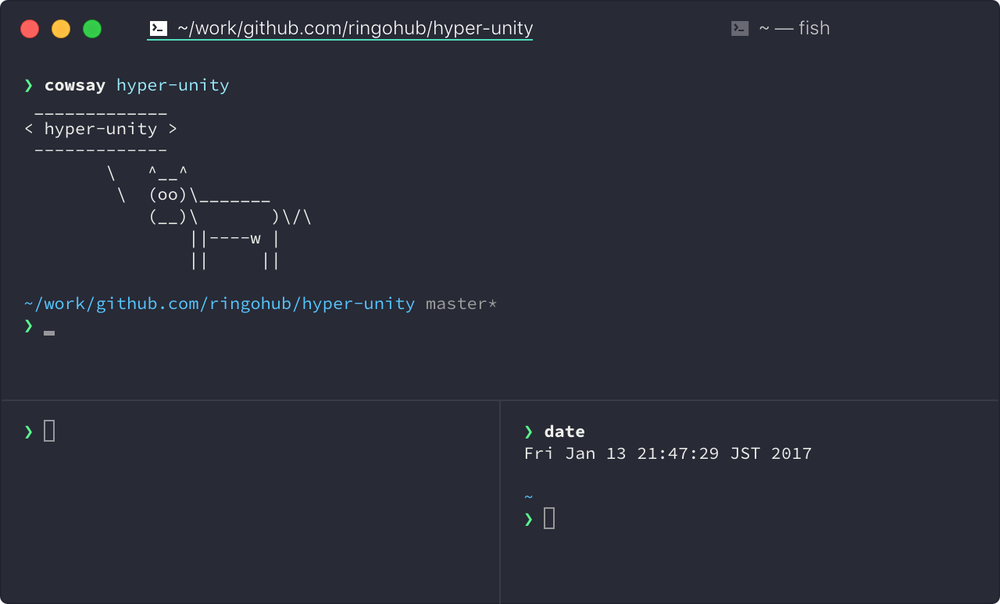

# hyper-unity

Unity tab style for the [hyper](https://hyper.is/).

- Remove border from tabs.
- Underline indicates current tab.
- Slim split border.

- This SS theme is [sindresorhus/hyper-snazzy](https://github.com/sindresorhus/hyper-snazzy)
